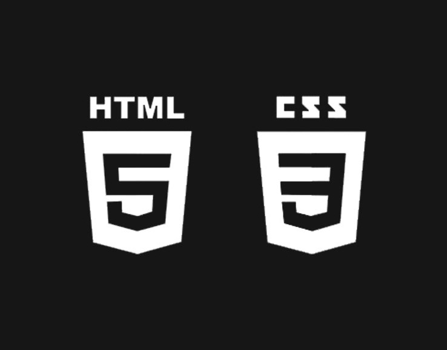

# <i><b>Основы веб-верстки HTML/CSS</b>
# <b>Home work 10</b>
## <b> Проверка сайта на ошибки и вспомогательные инструменты </b>

# <b>Задание:</b></i>
Выполнил: Манкатаев Э.О.
> <b>Макет:</b>
> https://www.figma.com/file/mnLY69cYE5cqWM5w6n5hXx/Seo-%26-Digital-Marketing-Landing-Page?node-id=190%3A1194
<i><b>
1. Доделать, если что-то не получилось реализовать на прошлом уроке.
2. Проверить сайт на ошибки.
3. Разместить сайт в сети интернет.

</i></b>